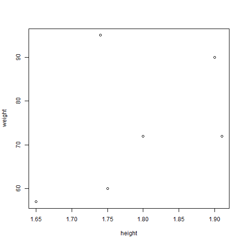
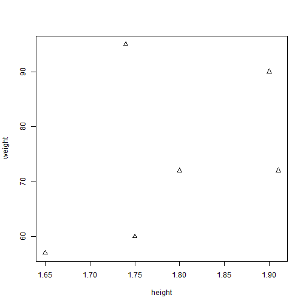
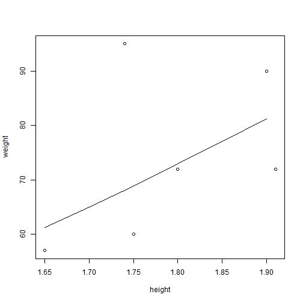

``` r
weight <- c(60, 72, 57, 90, 95, 72) 
height <- c(1.75, 1.80, 1.65, 1.90, 1.74, 1.91)
subject <- c("A", "B", "C", "D", "E", "F")
```


``` r
plot(height, weight)
```




``` r
plot(height, weight, pch=2)
```




``` r
args(plot.default)
```

```
## function (x, y = NULL, type = "p", xlim = NULL, ylim = NULL, 
##     log = "", main = NULL, sub = NULL, xlab = NULL, ylab = NULL, 
##     ann = par("ann"), axes = TRUE, frame.plot = axes, panel.first = NULL, 
##     panel.last = NULL, asp = NA, xgap.axis = NA, ygap.axis = NA, 
##     ...) 
## NULL
```


``` r
?plot
```


``` r
plot(height, weight)
hh = c(1.65, 1.70, 1.75, 1.80, 1.85, 1.90)
lines(hh, 22.5 * hh^2)
```



